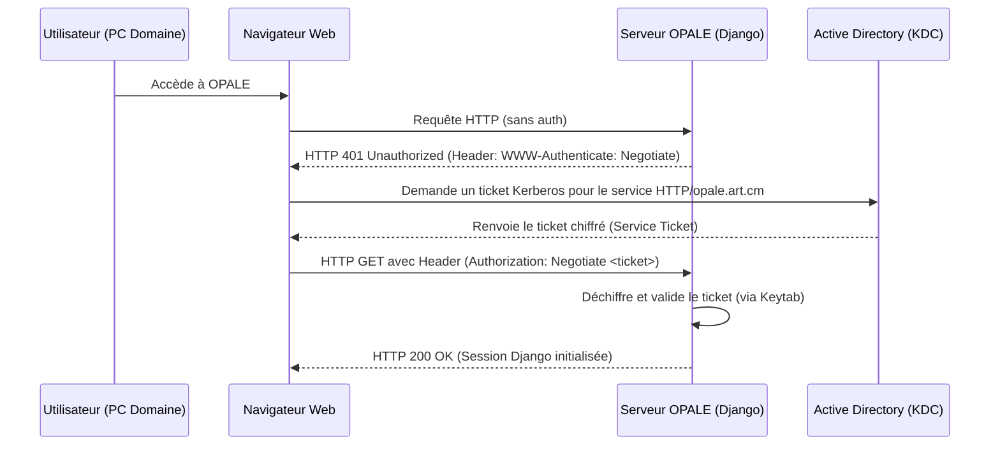

# Documentation : Configuration de Microsoft Active Directory pour OPALE

Ce document détaille les étapes nécessaires pour configurer **Microsoft Windows Server Active Directory (AD)**, localiser et récupérer les informations requises pour renseigner le fichier de configuration `ldap_config.json`, et comprendre le fonctionnement du SSO (LDAP/LDAPS et SSO Kerberos).

---

## Sommaire
1. [Concepts de Base & Protocoles SSO Microsoft](#1-concepts-de-base--protocoles-sso-microsoft)
2. [Étape 1 : Activer le LDAP Sécurisé (LDAPS) sur Windows Server](#2-étape-1--activer-le-ldap-sécurisé-ldaps-sur-windows-server)
3. [Étape 2 : Créer le Compte de Service & Déléguer les Privilèges](#3-étape-2--créer-le-compte-de-service--déléguer-les-privilèges)
4. [Étape 3 : Récupérer les Informations pour `ldap_config.json`](#4-étape-3--récupérer-les-informations-pour-ldap_configjson)
5. [Étape 4 : SSO Transparent via Kerberos / SPNEGO (Optionnel)](#5-étape-4--sso-transparent-via-kerberos--spnego-optionnel)

---

## 1. Concepts de Base & Protocoles SSO Microsoft

Pour réaliser un Single Sign-On (SSO) dans un environnement d'entreprise Windows, deux protocoles majeurs sont utilisés :

*   **LDAP / LDAPS (Lightweight Directory Access Protocol)** :
    *   *Rôle* : Utilisé par OPALE pour vérifier les identifiants saisis par les utilisateurs (liaison de vérification), lire leurs attributs (Nom, Prénom, Rôle, Direction), et synchroniser en temps réel les créations, modifications et suppressions.
    *   *Avantage* : Simple à déployer, fonctionne sur tout type de réseau (Web, VPN, local).
*   **Kerberos (SPNEGO / Integrated Windows Authentication)** :
    *   *Rôle* : Permet une authentification **100% transparente (Zero-Touch)**. L'utilisateur connecté à sa session Windows ouvre son navigateur, et le navigateur transmet automatiquement son ticket Kerberos à OPALE via les en-têtes HTTP (`Authorization: Negotiate <ticket>`). L'utilisateur n'a jamais besoin de saisir son mot de passe sur le portail Web.
    *   *Avantage* : Expérience utilisateur parfaite au sein du domaine.

---

## 2. Étape 1 : Activer le LDAP Sécurisé (LDAPS) sur Windows Server

Par défaut, Active Directory autorise uniquement les requêtes de lecture sur le port LDAP non sécurisé (`389`). Cependant, **les écritures et les modifications de mots de passe (`unicodePwd`) sont bloquées sur le canal non chiffré**.

Pour activer LDAPS (port `636`) :
1.  **Installer l'Autorité de Certification (AD CS)** :
    *   Sur le Contrôleur de Domaine (DC), ouvrez le **Gestionnaire de serveur**.
    *   Cliquez sur **Ajouter des rôles et fonctionnalités**.
    *   Sélectionnez et installez le rôle **Services de certificats Active Directory (AD CS)**.
2.  **Génération automatique du certificat** :
    *   Une fois AD CS configuré en tant qu'Autorité de Certification Entreprise racine, le contrôleur de domaine va automatiquement demander et installer un certificat contenant son nom DNS (par exemple `ad-server.art.cm`).
    *   Redémarrez le service Active Directory ou le serveur pour appliquer le certificat.
3.  **Vérification de LDAPS** :
    *   Ouvrez la console de commande sur le serveur Windows et lancez l'utilitaire `ldp.exe`.
    *   Allez dans **Connexion** > **Se connecter...**
    *   Saisissez le nom DNS de votre serveur AD, le port `636`, cochez **SSL**, puis cliquez sur OK.
    *   Si la connexion réussit et affiche des métadonnées dans la fenêtre de droite, le port LDAPS est prêt.

---

## 3. Étape 2 : Créer le Compte de Service & Déléguer les Privilèges

Pour qu'OPALE puisse écrire dans l'Active Directory (création de comptes, réinitialisation de mots de passe), vous devez lui fournir un compte de service dédié possédant les droits d'écriture adéquats.

### A. Créer le compte utilisateur de service
1.  Ouvrez la console **Utilisateurs et ordinateurs Active Directory** (`dsa.msc`).
2.  Créez un nouvel utilisateur dans l'OU de votre choix (ex: `svc_opale`).
3.  Définissez un mot de passe fort et cochez **Le mot de passe n'expire jamais**.

### B. Déléguer les privilèges d'écriture sur l'OU cible
Plutôt que de donner les droits d'Administrateur du Domaine (ce qui présente un risque de sécurité), utilisez la fonction de délégation d'Active Directory :
1.  Dans la console `dsa.msc`, faites un clic droit sur l'Unité Organisationnelle (OU) où seront stockés les utilisateurs d'OPALE (par exemple, `OU=Users,DC=art,DC=cm`).
2.  Sélectionnez **Déléguer le contrôle...**
3.  Ajoutez l'utilisateur de service créé précédemment (`svc_opale`).
4.  Sélectionnez **Créer, supprimer et gérer les comptes d'utilisateurs** et **Réinitialiser les mots de passe utilisateur et forcer le changement de mot de passe à la prochaine ouverture de session**.
5.  Cliquez sur Suivant et Terminer.

---

## 4. Étape 3 : Récupérer les Informations pour `ldap_config.json`

Voici comment localiser chaque valeur sur votre serveur Windows AD :

| Paramètre JSON | Description / Exemple | Où le trouver sur Windows Server AD |
| :--- | :--- | :--- |
| **`SERVER_TYPE`** | `"ACTIVE_DIRECTORY"` | Renseigner `"ACTIVE_DIRECTORY"` pour activer le schéma spécifique à Microsoft. |
| **`SERVER_URL`** | `"ldaps://nom-serveur-ad.art.cm:636"` | Le nom DNS (FQDN) complet du serveur AD. **Important :** Utilisez le FQDN (pas l'IP) pour que la validation SSL du certificat corresponde. |
| **`DOMAIN`** | `"art.cm"` | Nom de domaine Active Directory. Visibile au sommet de l'arborescence dans `dsa.msc`. |
| **`BASE_DN`** | `"dc=art,dc=cm"` | Nom distingué de la racine de l'annuaire. Si le domaine est `art.cm`, le DN racine est `DC=art,DC=cm`. |
| **`USER_OU`** | `"OU=Users,dc=art,dc=cm"` | OU contenant les utilisateurs d'OPALE. Clic droit sur l'OU dans `dsa.msc` > **Propriétés** > onglet **Éditeur d'attributs** > double-clic sur `distinguishedName` pour copier la valeur. |
| **`GROUP_OU`** | `"OU=Groups,dc=art,dc=cm"` | OU contenant les groupes de rôles (`CN=admins`, `CN=managers`, `CN=employes`). Même méthode de récupération que `USER_OU`. |
| **`BIND_USER`** | `"svc_opale@art.cm"` ou `"CN=svc_opale,OU=ServiceAccounts,DC=art,DC=cm"` | L'identifiant (UPN ou DN) du compte de service créé à l'étape 2. |
| **`BIND_PASSWORD`** | `"MotDePasseSvc123!"` | Le mot de passe associé au compte de service. |
| **`USE_SSL`** | `true` | Mettre à `true` si le port sécurisé `636` a été configuré (Recommandé). |
| **`VERIFY_CERT`** | `false` (ou `true`) | Mettre à `false` si le certificat du serveur AD est auto-signé ou émis par une autorité interne non approuvée par le serveur hébergeant OPALE. |

---

## 5. Étape 4 : SSO Transparent via Kerberos / SPNEGO (Optionnel)

Si vous souhaitez étendre l'application pour offrir une connexion automatisée sans mot de passe, voici le flux requis pour implémenter l'authentification Kerberos SPNEGO :



### Configuration requise côté Windows Server :
1.  **Créer un SPN (Service Principal Name)** :
    Le serveur Web d'OPALE doit être enregistré auprès d'Active Directory. Utilisez la commande suivante dans l'invite de commande d'un contrôleur de domaine (en tant qu'Administrateur) :
    ```cmd
    setspn -A HTTP/opale.art.cm svc_opale
    ```
    *(Où `opale.art.cm` est l'adresse URL de l'application et `svc_opale` est le compte de service).*
2.  **Générer le fichier Keytab** :
    Ce fichier contient la clé de chiffrement partagée qui permettra à l'application Django de déchiffrer les tickets Kerberos envoyés par les navigateurs sans contacter l'AD à chaque fois.
    ```cmd
    ktpass /out opale.keytab /princ HTTP/opale.art.cm@ART.CM /mapuser svc_opale@ART.CM /pass MotDePasseSvc123! /crypto All /ptype KRB5_NT_PRINCIPAL
    ```
3.  **Transférer la Keytab** :
    Copiez le fichier généré `opale.keytab` de manière sécurisée vers le serveur hébergeant Django (dans un dossier protégé accessible uniquement par le processus Django).

### Évolution du Code Python/Django :
Pour intégrer cette brique dans l'application, il suffira de rajouter la bibliothèque `django-gssapi` ou `django-auth-spnego` qui fournira le middleware HTTP lisant l'en-tête `Negotiate` et connectant automatiquement l'utilisateur à partir de son `sAMAccountName` (présent dans le ticket Kerberos).
