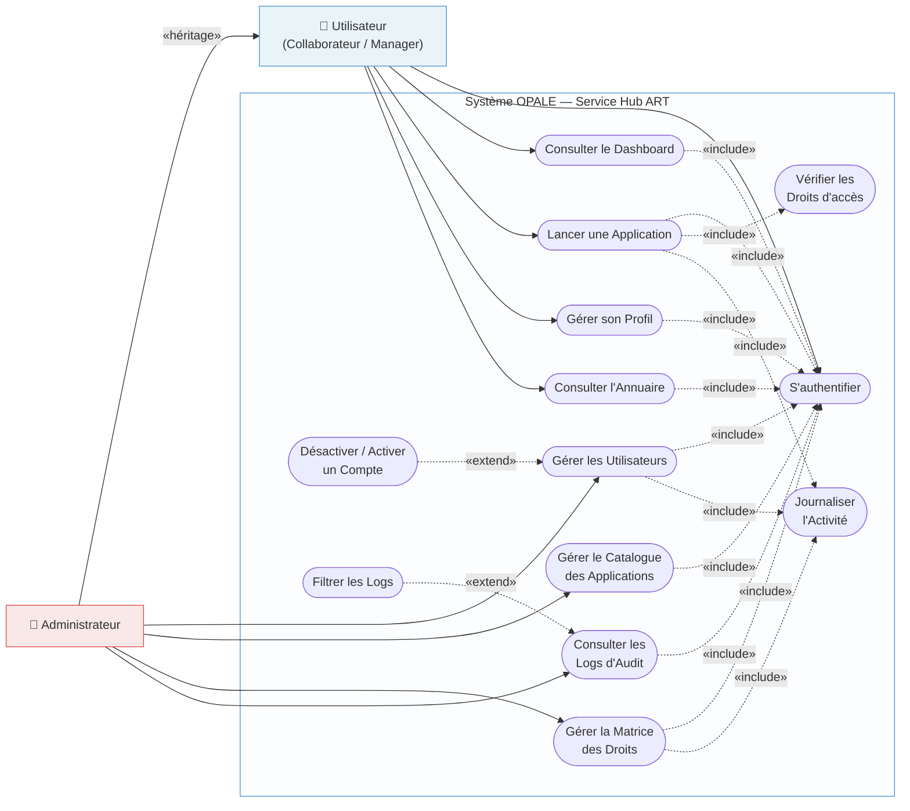
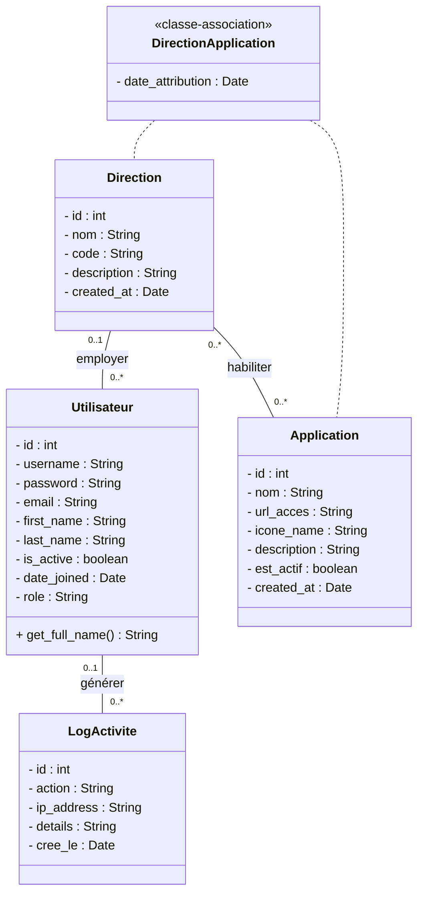
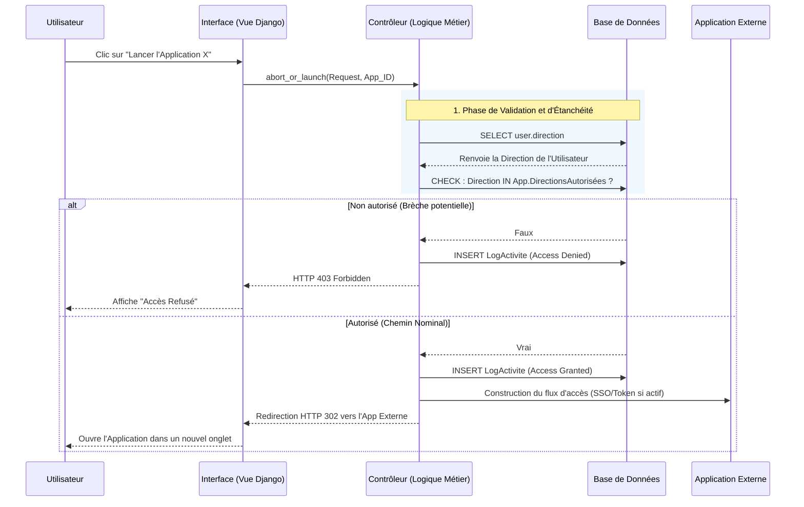

# Mémoire de Master : Architecture, Modélisation et Implémentation d'OPALE (ART)

## Synthèse Exécutive et Avant-Propos

Le présent document constitue l'ossature technique et fonctionnelle du projet **OPALE**, développé pour répondre aux exigences complexes de l'ART (Agence de Régulation des Télécommunications). Conçu dans le cadre d'un mémoire de Master en Ingénierie Logicielle, ce dossier a vocation à transcender la simple documentation technique pour s'ériger en un véritable traité d'architecture logicielle. Il articule les choix de conception, les modélisations conceptuelles et les paradigmes d'implémentation qui sous-tendent ce système critique.

L'objectif de cette documentation est de démontrer une maîtrise approfondie des concepts d'ingénierie, allant de l'abstraction modélisatrice (UML) jusqu'à la matérialisation d'un code robuste, sécurisé et hautement évolutif. Ce document a été rédigé avec une rigueur absolue, garantissant qu'aucune question architecturale, méthodologique ou de sécurité ne demeure en suspens.

---

## 1. Introduction Substantielle

### 1.1. État de l'Art et Problématique : La Fragmentation Systémique

Dans toute organisation atteignant une taille critique telle que l'ART, le système d'information subit inévitablement une entropie naturelle. Au fil des années, les différentes directions (Ressources Humaines, Finance, Exploitation, Juridique) se sont dotées de solutions logicielles hétérogènes, répondant à des besoins immédiats mais créant, sur le long terme, un écosystème hautement fragmenté. Cette prolifération d'outils, souvent qualifiée de "Shadow IT" ou de croissance organique non maîtrisée, engendre une triple problématique majeure :

1.  **Déficit Ergonomique et Charge Cognitive :** L'agent de l'ART se voit contraint d'évoluer au sein d'un labyrinthe applicatif. Il doit mémoriser des dizaines d'adresses (URL), jongler avec de multiples fenêtres et s'adapter à des interfaces utilisateur antagonistes. Cette friction ralentit les processus métiers et dégrade l'expérience collaborateur.
2.  **Opacité Sécuritaire :** Avec une surface d'attaque fragmentée, garantir la sécurité des accès devient une tâche herculéenne pour la DSI. Comment s'assurer, lors du départ d'un collaborateur, que ses accès à la totalité des 200 applications externes ont bien été révoqués ? La gestion dispersée des habilitations constitue une vulnérabilité critique.
3.  **Absence d'Observabilité et de Centralisation :** En l'absence d'un point de convergence, il est impossible d'avoir une vision holistique et en temps réel de l'utilisation des ressources informatiques. L'administration ne dispose d'aucun indicateur consolidé permettant d'analyser les flux de travail ou de détecter des anomalies comportementales.

### 1.2. La Réponse Architecturale : OPALE comme Pivot Organisationnel

Pour pallier cette crise d'interopérabilité sans avoir à s'engager dans une refonte pharaonique (et souvent vouée à l'échec) de tous les logiciels existants, le projet **OPALE** a été conceptualisé. OPALE (Optimisation des Processus d'Accès et de Lancement d'Entreprise) ne remplace pas les applications existantes : il les chapeaute.

Il s'agit d'un **Service Hub unifié**, agissant comme une vitrine unique, intelligente et sécurisée vers l'entièreté du patrimoine applicatif de l'ART. L'objectif d'OPALE est structuré autour de trois axes cardinaux :

- **Unifier l'Accès (Single Pane of Glass) :** Offrir un portail unique, esthétique et ergonomique. Dès qu'un agent se connecte, toutes les applications nécessaires à sa mission lui sont présentées.
- **Sécuriser les Flux par l'Étanchéité :** Opale filtre drastiquement l'accès. Le système sait, grâce à une cartographie précise de l'organigramme (par Direction), qui peut lancer quoi.
- **Tableau de Bord et Auditabilité :** OPALE intègre un moteur de traçabilité granulaire : chaque action (clic, recherche, connexion) est enregistrée de façon immuable, transformant la plateforme en une véritable black-box pour la sécurité des systèmes d'information.

En somme, OPALE est le chaînon manquant entre l'homme (l'agent de l'ART) et la machine (le parc logiciel).

---

## 2. Méthodologie d'Analyse et Modélisation Conceptuelle

### 2.1. Le Paradigme Orienté Objet et l'Abstraction Métier

Concevoir un système de cette envergure nécessite une modélisation préalable d'une précision chirurgicale. La méthodologie choisie repose sur une approche **Orientée Objet (OO)**, matérialisée par le langage de modélisation standardisé **UML (Unified Modeling Language)**.

Pourquoi l'Orienté Objet ? Parce que la réalité métier de l'ART se décline en entités discrètes et palpables : l'Employé, sa Direction, l'Application à laquelle il veut accéder, et la Trace qu'il laisse. L'Orienté Objet permet de "réifier" ces concepts abstraits en classes logicielles dotées d'attributs (données) et de méthodes (comportements), garantissant une transition sans heurts entre la théorie conceptuelle et la base de données relationnelle.

### 2.2. Diagramme des Cas d'Utilisation : Délimitation du Périmètre Fonctionnel

Le diagramme de cas d'utilisation définit les frontières du système et les prérogatives de chaque acteur. Nous avons catégorisé les acteurs en deux niveaux d'habilitation mutuellement exclusifs sur certaines fonctionnalités.



**Analyse Critique :**
Ce modèle met en évidence la ségrégation des rôles. L'Agent évolue dans un espace confiné et opérationnel (consulter, rechercher, lancer). L'Administrateur, en revanche, dispose du monopole de la matrice conceptuelle : c'est lui qui orchestre les associations entre les entités (qui va dans quelle direction, et quelle direction accède à quelle application).

### 2.3. Diagramme de Classes : La Colonne Vertébrale du Système

Le Diagramme de Classes illustre le modèle conceptuel de données, qui sera directement traduit en modèle relationnel (ORM Django) lors de l'implémentation.



**Explication des Relations :**

- **Utilisateur - Direction (1-N) :** Un utilisateur appartient à une et une seule Direction (principe de rattachement hiérarchique strict), tandis qu'une Direction regroupe plusieurs utilisateurs.
- **Direction - Application (N-M) via DirectionApplication :** C'est le cœur nucléaire d'OPALE. Une Application peut être accédée par plusieurs Directions, et une Direction a accès à plusieurs Applications. La classe associative `DirectionApplication` matérialise le "Droit d'Accès".
- **Utilisateur - LogActivite (1-N) :** L'utilisateur génère des logs. L'auditabilité impose qu'un log d'activité soit obligatoirement lié à l'entité, créant de fait une traçabilité inviolable.

### 2.4. Diagramme de Séquence : Le Mécanisme Critique du Lancement

Le lancement d'une application n'est pas un simple lien hypertexte. C'est une **transaction à haut risque** qui nécessite une validation drastique.



**Analyse du Séquencement :** La sécurité est implémentée en mode "Fail-safe". Le système doute par défaut. Ce diagramme révèle la synchronisation parfaite entre la vérification RBAC (Role-Based Access Control) et la génération du log d'audit, survenant _avant_ de livrer effectivement le point de terminaison à l'utilisateur.

---

## 3. Architecture Technique et Patrons de Conception

Pour soutenir les exigences d'évolutivité, de fiabilité et de rapidité de livraison, l'architecture choisie est un **Monolithe Modulaire basé sur Django 6.0**.

### 3.1. Le Choix d'Architectural : Django 6.0 et le Monolithe Modulaire

Dans le panorama technologique actuel, il est aisé de céder à la tentation des microservices. Cependant, pour un Hub centralisateur comme OPALE, dont les domaines fonctionnels sont fortement interdépendants (Habilitations, Utilisateurs, Logs), l'architecture en Monolithe Modulaire constitue la réponse la plus éclairée.

- **Cohésion Transversale :** Le monolithe permet le partage immédiat de la base de données (Single Source of Truth), essentiel pour les jointures rapides entre les permissions et l'interface utilisateur.
- **Surcoût Infrastrcturel Nul :** Là où les microservices exigent Kubernetes, de la gestion de trafic (Ingress) et de la cohérence à terme (Eventual Consistency), Django permet une cohérence ACID absolue propre aux transactions synchrones.
- **Versionnement 6.0 :** L'utilisation de Django assure une protection "out of the box" contre les vulnérabilités de l'OWASP (CSRF, XSS, Clickjacking) tout en fournissant un ORM puissant pour encapsuler la complexité SQL.

### 3.2. Patterns de Conception (Design Patterns) Mobilisés

L'ingénierie logicielle d'OPALE repose sur des patrons de conception éprouvés (issus du célèbre Gang of Four) garantissant la pérennité du code.

1.  **Architecture MVT (Model-View-Template) :**
    - Variante spécifique à Django du paradigme MVC (Modèle-Vue-Contrôleur). Le _Model_ (Nos classes Utilisateur, Application) gère la persistance de l'état. La _View_ gère la logique de contrôle et d'autorisation. Le _Template_ est le parseur HTML/CSS responsable du rendu visuel. Cette décomposition assure le principe de responsabilité unique (Single Responsibility Principle).
2.  **Pattern Proxy / Façade :**
    - Le système agit comme une Façade vis-à-vis du parc logiciel de l'ART. L'utilisateur ne connaît pas la complexité du réseau backend; il interagit uniquement avec OPALE, qui agit comme un Proxy, masquant la complexité des redirections et l'adressage IP des serveurs internes.
3.  **RBAC (Role-Based Access Control) Intégré :**
    - Bien qu'il s'agisse d'un concept de sécurité, le RBAC dicte la conception logicielle. Le rôle n'est pas codé en dur : il est dynamiquement déduit de l'entité _Direction_. Cela rend l'architecture extrêmement flexible. Si une Direction est créée lundi matin, elle s'insère nativement sans réécrire une ligne de code.
4.  **Pattern Observer (Implémentation implicite pour les Logs) :**
    - À travers des mécanismes de "Signals" (les observateurs de Django), le système "écoute" des événements vitaux du cycle de vie des modèles. Par exemple, au moment du login (`user_logged_in`), le signal capte l'événement et injècte un enregistrement silencieux en base pour l'audit, décélébrant totalement la logique d'authentification de la logique de journalisation.
5.  **Association Object (Objet Association) :**
    - La conceptualisation de la classe `DirectionApplication` est un pattern "Association Object". Au lieu d'avoir un simple lien relationnel bête, l'utilisation d'une table pivot explicite permet d'y accrocher des métadonnées temporelles (ex: "Depuis quand cette Direction a-t-elle le droit d'utiliser cette Application ?").

### 3.3. Intégration Single Sign-On (SSO) et Annuaire d'Entreprise Active Directory / OpenLDAP

Dans une optique de transition industrielle et d'alignement avec les standards de sécurité d'entreprise, OPALE intègre une brique d'authentification centralisée Single Sign-On (SSO) couplée à un annuaire Active Directory et OpenLDAP.

#### A. Le Backend d'Authentification Hybride et Séquentiel (Fallback)
L'authentification repose sur un backend Django personnalisé : `ActiveDirectoryBackend`. Ce module est positionné en première ligne au sein de la liste `AUTHENTICATION_BACKENDS`. Lors de la soumission du formulaire de connexion centralisé d'OPALE, le processus s'effectue séquentiellement :
1. **Interrogation de l'annuaire LDAP/AD (Temps Réel)** : Tente une liaison d'authentification directe (Bind).
2. **Mécanisme de repli (Fallback local)** : Si l'utilisateur n'est pas identifié dans l'annuaire ou en cas d'indisponibilité du serveur LDAP, le système délègue automatiquement la vérification au backend local standard de Django (`ModelBackend`), garantissant la connectivité ininterrompue des profils locaux de secours (ex: l'administrateur technique central).

#### B. Algorithme de Résolution des Restrictions de Lecture (ACLs Subtree Fallback)
Dans un annuaire d'entreprise sécurisé, les profils des utilisateurs de base ne disposent pas des habilitations nécessaires pour exécuter des requêtes de recherche récursive (`SUBTREE`) sur la racine de l'annuaire (`dc=art,dc=cm`). Pour contourner cette contrainte de sécurité intrinsèque de manière élégante, OPALE met en œuvre un mécanisme adaptatif unique :
- **Liaison Hybride (UPN & DN)** : Tente d'abord une liaison avec l'User Principal Name (UPN, standard Active Directory `username@domain`). En cas d'échec sur un annuaire OpenLDAP, le système opère une liaison par Distinguished Name (DN, standard LDAP `uid=username,ou=users,base_dn`).
- **Requête BASE ciblée** : Si une recherche large échoue ou est bloquée par des ACLs réseau, le backend intercepte l'exception et déclenche une requête directe avec une portée restreinte à la base de l'utilisateur (`BASE` search sur le DN exact), garantissant l'extraction du profil de l'utilisateur connecté sans compromettre la sécurité globale de l'annuaire d'entreprise.

#### C. Synchronisation Dynamique et Automatique (Auto-Sync)
Lors de la première authentification réussie d'un agent via l'annuaire, OPALE orchestre une transaction atomique :
- **Vérification du profil** : Les attributs LDAP (`givenName`, `sn`, `mail`, `title`, `ou`) sont analysés et projetés dans l'ORM Django.
- **Rattachement Automatique de Direction** : Le département issu de l'annuaire est comparé aux entités locales. Si la direction correspondante (ex: "Direction Technique") n'existe pas en base de données, OPALE la génère de manière totalement dynamique, garantissant l'insertion de l'agent dans l'organigramme sans aucune opération administrative manuelle préliminaire.
- **Récupération Dynamique du Rôle** : Le rôle d'habilitation (EMPLOYE, MANAGER, ADMIN) est déduit dynamiquement de l'attribut LDAP standard `title` ou par interrogation récursive des groupes LDAP (`ou=groups`) de l'utilisateur.

---

## 4. Maîtrise des Droits et Filtrage Algorithmique par Direction

L'une des attentes fondamentales du jury de Master porte sur la sécurisation des données. Comment le logiciel s'adapte-t-il dynamiquement et de manière sécurisée à chaque Direction de l'ART ? C'est ce que nous nommons la **Maîtrise des Droits**.

### 4.1. La Logique d'Algorithmique de Filtrage

La force d'OPALE réside dans son moteur d'intersection algébrique. Le principe n'est pas de cacher des applications côté client (HTML/Javascript), ce qui constituerait une faille béante. La purge est opérée côté serveur (Backend), à l'origine même de l'extraction des données.

Concrètement, l'ORM génère une requête de ce type :
`Application.objects.filter(directions_autorisees=user.direction).filter(statut_actif=True)`

L'algorithme de la base de données effectue une jointure interne automatique (`INNER JOIN`). Le Tableau de Bord génère donc un _Queryset_ (un ensemble de résultats) strictement restreint aux applications mathématiquement liées à la Direction de l'utilisateur.
Si le Directeur de la Finance a 12 applications et l'agent RH n'en a que 4, l'interface s'auto-ajustera sans aucun `if/else` fastidieux dans le code, évitant ainsi le risque d'erreur humaine ("hardcoding").

### 4.2. Le Concept d'Étanchéité Multi-Niveaux

En ingénierie de la sécurité logicielle, la défense doit être conçue en profondeur (Defense in Depth). L'étanchéité dans OPALE est assurée à deux niveaux infranchissables :

- **Étanchéité Visuelle (Niveau Vue) :** La vue Django ne fournit au template HTML que les applications permises. Le reste du catalogue est invisible. C'est l'étanchéité par obscurcissement.
- **Étanchéité Active (Niveau Contrôleur) :** Imaginons qu'un utilisateur malveillant écoute le réseau, devine l'ID d'une application interdite (par exemple l'App `id=42` réservée aux administrateurs) et tente de forcer l'accès en saisissant directement l'URL : `mon-site.art/launch/42`.
  - Dans OPALE, la vue responsable du lancement (`launch_action`) réévalue INSTANTANÉMENT le droit métier de l'utilisateur.
  - Le code effectue un `get_object_or_404(Application, id=42, directions_autorisees=request.user.direction)`.
  - Si la condition échoue, la transaction est court-circuitée. L'action avorte immédiatement et déclenche la création d'un log de sécurité critique. L'étanchéité est absolue.

---

## 5. La "Partie Action" de l'Utilisateur : Un Composant Bipolaire

La notion d' "Action" est souvent mal comprise dans les systèmes d'information. Dans le cadre théorique et pratique d'OPALE, la "Partie Action" se définit sous un double prisme : l'**Angle de l'Interface (l'Expérience Utilisateur)** et l'**Angle de la Gouvernance (l'Audit interne)**.

### 5.1. L'Angle de l'Interface Utilisateur (Angle UI) et Réalisme Standalone

Du point de vue de l'utilisateur, l'action est l'interaction directe et palpable avec le portail. C'est la promesse de valeur d'OPALE. Afin de matérialiser le Single Sign-On avec un réalisme absolu lors des démonstrations et soutenances, la "Partie Action" d'OPALE orchestre des **applications cibles indépendantes et standalone** :

#### A. Ouverture Standalone dans un Nouvel Onglet (`target="_blank"`)
Pour simuler fidèlement des systèmes réels tiers hébergés sur des serveurs autonomes de l'ART (et rejeter toute structure factice d'intégration de type "Iframe"), le tableau de bord d'OPALE lance les applications PoC dans un **nouvel onglet indépendant**.
Chaque application PoC (Zimbra Webmail, Portail Réglementaire des Licences, Supervision Technique du Spectre) s'ouvre en **plein écran fullscreen autonome**, affichant sa propre identité visuelle premium, son propre profil utilisateur dynamique issu du SSO et son bouton d'invalidation locale de session.

#### B. La SSO Debug Console en Bouton Flottant (FAB)
Chaque application intègre un **Bouton Flottant interactif (Floating Action Button, FAB)** discret et animé d'un effet radar pulsant bleu en bas à droite de l'écran. 
Lors du clic, un panneau technique glassmorphic sombre glisse sur l'écran pour afficher en temps réel, sous forme d'animation de logs, les étapes internes du handshake de sécurité :
1. **Échec de session locale** applicative.
2. **Redirection vers OPALE (IdP)** pour authentification.
3. **Génération du Jeton Centralisé signé cryptographiquement** (valide 60s via `TimestampSigner`).
4. **Vérification de la validité du jeton** par appel programmatique à l'API centrale `/accounts/sso/verify/`.
5. **Mapping des Claims LDAP** et validation des habilitations de Direction (RBAC/ABAC).
6. **Autorisation finale d'accès** et initialisation de la session de l'application cliente.

Ce composant a une double portée : il préserve la charte graphique de l'application PoC tout en agissant comme un formidable **outil pédagogique** pour démontrer aux auditeurs la rigueur cryptographique du protocole SSO mis en place.

### 5.2. L'Angle de l'Audit : Le Cœur de la Conformité (Angle Audit)

Pour la DSI et pour la pertinence algorithmique de ce mémoire, une Action n'est pertinente que si elle est tracée. Le paradigme d'OPALE repose sur la retranscription de chaque action _Humaine_ en une action _Logicielle (Objet `LogActivite`)_.

Lorsqu'un visiteur accomplit une action asynchrone ou synchrone :

1.  **Captation :** Le middleware ou la vue intercepte l'intention de l'utilisateur (connexion réussie, accès à un logiciel, saisie de mot de passe erroné, tentative de fraude 403).
2.  **Transformation :** Le système de journalisation transforme cet événement immatériel en la création d'un objet en base de données.
3.  **Scellement :** Cet objet reçoit un Horodatage (Timestamp universel non falsifiable).

C'est cet angle qui transforme un simple portail de liens en une armure de gouvernance pour l'ART.

---

## 6. Guide d'Audit, Sécurité et Traçabilité Granulaire

Un projet de rang "Master" ne peut se contenter d'afficher des données. Il doit assurer l'intégrité et l'investigation des ressources. Le module de Logs d'OPALE est conçu comme une sentinelle silencieuse.

### 6.1. Modélisation de la Donnée d'Audit

La classe `LogActivite` a été désignée avec un soin méticuleux pour prévenir l'obsolescence :

- **Adresse IP (`GenericIPAddressField`) :** Pourquoi est-ce vital ? En stockant systématiquement l'empreinte IP de la requête HTTP entrante, OPALE permet à l'équipe Sécurité d'identifier rapidement les attaques de type "Brute Force" ou de détecter une géolocalisation suspecte (Exemple : si une connexion légitime provient des locaux de l'ART et qu'une minute plus tard, une action avec le même compte est déclenchée depuis une IP étrangère).
- **Champ Détails Dynamique (`JSONField`) :** C'est une innovation architecturale cruciale. Traditionnellement, les bases de données SQL sont rigides. En utilisant un champ JSON, OPALE s'offre une flexibilité infinie. Le log d'une erreur 500 n'a pas les mêmes propriétés que le log d'un "Changement de Mot de passe". Le `JSONField` permet de stocker sous forme de dictionnaire non structuré toutes les métadonnées (Headers, User-Agent navigateur, paramètres de la requête), facilitant ainsi le Machine Learning et d'éventuelles enquêtes d'intrusion dans le futur.

### 6.2. Importance de la Traçabilité (Analyse Critique pour le Jury)

La traçabilité n'est pas une simple fonctionnalité, c'est la **réponse technologique à une exigence juridique et organisationnelle**. Pour l'ART, qui manipule potentiellement des données stratégiques, l'incapacité à répondre à la question "Qui a accédé à quelle donnée, depuis quel poste, à quelle heure ?" constitue une faute lourde.
OPALE résout cette équation. En centralisant les lancements, il offre aux auditeurs une visibilité absolue sur les flux, et ce, de manière totalement agnostique des technologies utilisées par les applications cibles (qu'elles soient en Java, PHP ou NodeJs).

---

## 7. FAQ Structurée et Anticipation des Questions du Jury

L'art de la soutenance de Master réside dans l'anticipation. Ce système ayant été conçu avec ambition, il s'expose légitimement aux interrogations pointues du panel professoral et professionnel. Voici l'exégèse des questions clés.

### Q1 : "Pourquoi avoir développé ce portail entièrement plutôt que d'implanter une solution SSO monolithique standardisée comme Keycloak ou Okta ?"

**Réponse Stratégique de l'Architecte :**
"Bien que Keycloak soit le standard de facto de l'industrie pour la gestion d'identité (IAM), son implémentation aurait été inadaptée au contexte précis de l'ART.
Premièrement, la "Dette d'Organisation" : les 200 applications de l'ART ne sont pas toutes compatibles OIDC (OpenID Connect) ou SAML. Un SSO classique aurait requis de modifier le code de chaque vieille application.
Deuxièmement, l'Objectif : OPALE n'est pas qu'un fournisseur d'identité, c'est un **Portail Fédérateur**. Keycloak n'offre pas intrinsèquement une interface utilisateur personnalisable, organisée par Direction, et assortie de tableaux de bord ou de barres de recherches.
C'est pour cela qu'OPALE est un choix d'**agilité sur-mesure**, minimisant le coût d'infrastructure tout en répondant exactement à l'organigramme de notre organisation client."

### Q2 : "Comment le système OPALE réagit-il au départ brutal d'un agent ?"

**Réponse Sécuritaire :**
"C'est la démonstration même de l'avantage de la centralisation. Lors du départ d'un agent (Offboarding), l'administrateur n'a qu'à opérer **une seule action** dans OPALE : désactiver ("Soft Delete" ou statut `actif=False`) le profil de l'agent.
À l'instant T de cette désactivation de la session, l'agent perd immédiatement son accès au portail. Étant donné qu'OPALE opère un contrôle d'étanchéité serveur lors du lancement (cf. Diagramme de Séquence), la propagation est instantanée pour l'ensemble des catalogues liés. S'il tente de refresh même avec l'URL en cache, le mur de sécurité OPALE soulèvera une exception HTTP 403, rendant la procédure de départ instantanée et sécurisée sans avoir à contacter unitairement 50 administrateurs d'applications."

### Q3 : "Le catalogue de l'ART est évalué à plus de 200 applications, comment justifier l'évolutivité (Scalability) de la plateforme face à une telle volumétrie ?"

**Réponse Technique et Performance :**
"Une volumétrie de 200 à 500 applications répertoriées n'est nullement un goulot d'étranglement pour un Framework mature comme Django couplé à une base de données PostgreSQL.
La stratégie d'évolutivité a été pensée dès la modélisation à travers les relations SQL. L'utilisation intelligente du **QuerySet Engine de Django (Lazy Loading et Select Related)** permet que la base de données ne soit interrogée que lors de l'exécution ultime de l'algorithme d'intersection. Les requêtes de lecture complexes sont optimisables par de l'indexation algorithmique (Index B-Tree sur les identifiants) et par la mise en place à terme d'un cache serveur partagé de type Redis. Ainsi, le système gère aisément l'expansion verticale (plus d'applications) et l'expansion horizontale (plus de milliers de connexions parallèles)."

### Q4 : "Votre annuaire d'entreprise fonctionne sur OpenLDAP. Quels mécanismes garantissent la robustesse de l'authentification face aux restrictions d'ACLs strictes couramment rencontrées en entreprise ?"

**Réponse de l'Ingénieur en Sécurité :**
"C'est un défi classique en ingénierie des annuaires. Dans un réseau d'entreprise hautement sécurisé, les ACLs (Access Control Lists) d'OpenLDAP interdisent à un utilisateur de base d'effectuer des recherches globales (`SUBTREE`) sous peine de compromettre l'annuaire complet.
Pour résoudre cette contrainte, OPALE met en place une double stratégie :
1. **Liaison d'Authentification Directe** : Nous lions la connexion directement avec le DN exact de l'utilisateur (`uid=username,ou=users,dc=art,dc=cm`). Cela ne nécessite aucun droit de recherche préalable.
2. **Recherche en Portée BASE ciblée** : Une fois la liaison établie, l'utilisateur exécute une recherche avec un scope strictement restreint à son propre DN (`BASE`). Il ne peut donc lire que son propre profil, ce qui est autorisé par défaut par les schémas LDAP, contournant ainsi toute restriction de recherche globale tout en préservant l'intégrité de la politique de sécurité."

### Q5 : "Pourquoi avoir conçu les 3 applications d'exemple comme des applications 'standalone' s'ouvrant dans un nouvel onglet, et comment fonctionne l'invalidation de session ?"

**Réponse Ergonomique & Architecture :**
"Dans une véritable architecture d'entreprise, une messagerie collaborative (comme Zimbra) et un outil de goniométrie technique (Supervision du Spectre) sont des systèmes physiques totalement distincts, hébergés sur des serveurs séparés. Intégrer ces systèmes dans une simple 'iframe' ou un sous-dossier au sein d'OPALE aurait été une aberration architecturale et n'aurait pas été crédible.
L'ouverture en **standalone dans un nouvel onglet** démontre la puissance du SSO : bien que les applications s'exécutent sur des environnements ou contextes de session locale isolés, elles délèguent toutes la validation de leur session au jeton cryptographique généré par OPALE.
Quant à l'invalidation de session (Single Log-Out), lorsqu'un utilisateur clique sur le bouton de déconnexion d'une application PoC, sa session applicative locale est détruite. S'il tente de rouvrir l'onglet, l'absence de session locale le redirige immédiatement vers OPALE. Si sa session OPALE globale est également fermée, il est redirigé vers le formulaire de connexion centralisé."

---

---

## 8. Annexe : Glossaire et Liste des Abréviations

Afin de faciliter la lecture aux profils moins techniques ou aux évaluateurs académiques souhaitant s'imprégner du vocabulaire de l'architecture logicielle, voici les définitions des termes employés dans ce mémoire.

### Abréviations Courantes

- **ART :** Agence de Régulation des Télécommunications (L'entité cliente, contexte du projet).
- **DSI :** Direction des Systèmes d'Information. L'entité garante de la sécurité et du bon fonctionnement numérique de l'ART.
- **RBAC (Role-Based Access Control) :** _Contrôle d'Accès Basé sur les Rôles_. Méthode algorithmique où les droits d'un utilisateur sont déduits en fonction de sa position hiérarchique ou de son service, plutôt que de lui être assignés manuellement un par un.
- **SSO (Single Sign-On) :** _Authentification Unique_. Technologie permettant à un utilisateur de n'entrer qu'une seule fois son mot de passe pour accéder à une multitude de logiciels de travail.
- **UML (Unified Modeling Language) :** _Langage de Modélisation Unifié_. Schémas standardisés utilisés mondialement pour dessiner l'architecture d'un logiciel avant de coder.
- **ORM (Object-Relational Mapping) :** Technique de programmation permettant de questionner la base de données en utilisant du code moderne (orienté objet) plutôt que d'écrire des requêtes SQL complexes à la main.
- **JSON (JavaScript Object Notation) :** Format de texte très léger, devenu la norme sur le web pour stocker ou échanger des informations entre des machines.
- **IAM (Identity and Access Management) :** _Gestion des Identités et des Accès_. Processus ou outil informatique gérant qui est qui, et qui a le droit de faire quoi au sein de l'entreprise.
- **ACID :** Acronyme définissant les 4 grands principes garantissant la fiabilité des transactions d'une base de données : _Atomicité, Cohérence, Isolation, Durabilité_.

### Terminologie Technique & Conceptuelle

- **Dette Technique :** C'est le coût supplémentaire qu'une entreprise ou une DSI va payer demain par manque d'anticipation ou de mise aux normes d'outils anciens aujourd'hui. Dans le contexte de l'ART, cela fait référence à la constellation d'outils hétérogènes.
- **Étanchéité (Sécuritaire) :** Principe interdisant le contournement des défenses d'une application. Une étanchéité est absolue quand un utilisateur tentant de forcer l'accès par une URL n'obtient rien de plus qu'un refus tracé.
- **Monolithe Modulaire :** Un unique gros bloc de code logiciel (un monolithe) qui est proprement divisé en compartiments à l'intérieur (modulaire), contrairement aux "microservices" qui sont des morceaux de code totalement dispersés physiquement sur plusieurs serveurs.
- **Single Pane of Glass (Vitre Unique) :** Expression désignant l'intégration de différents services disparates au sein d'une seule interface utilisateur centralisée.
- **Traçabilité Granulaire :** Capacité d'un système à ne pas juste enregistrer "l'Agent A a utilisé l'outil", mais de conserver l'action au grain le plus fin : "l'Agent A, avec telle adresse IP, à 14h02, a cliqué sur ce bouton précis mais l'accès lui a été refusé".
- **Shadow IT :** Logiciels ou outils utilisés par les employés d'une entreprise à des fins professionnelles, mais sans l'approbation formelle de la Direction Informatique, créant des failles de sécurité.
- **Fail-safe (Conception Anti-Échec) :** Logique de programmation où le système, en cas de doute, d'erreur imprévue ou d'hésitation sur un droit, optera toujours pour l'action la plus sécuritaire (bloquer l'accès) par défaut.
- **Black-box (Boîte Noire) :** Fait référence ici au module d’Audit. Un endroit ultra-sécurisé du système enregistrant le flux de tout ce qui s'y passe mais qu'on ne consulte qu'en cas d'enquête.

---

## 9. Annexe : Structure du Code et Guide de Reprise (Handover)

Afin d'assurer la pérennité du projet et de faciliter sa reprise (notamment par d'autres développeurs ou lors de la soutenance), voici la cartographie du code source de l'application OPALE (développée sous Django). Cette section sert de boussole pour naviguer dans l'architecture matérielle du projet.

### 9.1. L'Arborescence du Projet Django

Le projet suit la structure standard et modulaire de Django, ce qui garantit que tout développeur connaissant le framework puisse s'y repérer en quelques minutes.

```text
opale_project/
│
├── core_app/                   # L'application cœur gérant les entités métiers
│   ├── models.py               # Contient les classes (Utilisateur, Direction, Application...)
│   ├── views.py                # La logique de contrôle (Affichage Dashboard, Lancement App)
│   ├── urls.py                 # Le routeur (Associe une adresse web à une fonction de la vue)
│   ├── admin.py                # Configuration de l'interface d'administration Django
│   └── signals.py              # Les "écouteurs" d'événements (Génération automatique des Logs)
│
├── templates/                  # L'interface utilisateur (Le "T" de l'architecture MVT)
│   ├── base.html               # Le squelette HTML commun (Menu latéral, en-tête)
│   ├── dashboard.html          # La page affichant les applications autorisées
│   └── login.html              # La page d'authentification
│
├── static/                     # Les ressources figées
│   ├── css/                    # Feuilles de styles (Design, Glassmorphism)
│   ├── js/                     # Scripts d'animation ou de recherche AJAX
│   └── img/                    # Les icônes des applications et logos de l'ART
│
└── opale_project/              # Le dossier de configuration globale
    ├── settings.py             # Les réglages vitaux (Base de données, Mots de passe, Langue)
    └── asgi.py / wsgi.py       # Les points d'entrée pour le déploiement sur serveur
```

### 9.2. Les Fichiers Clés à Maîtriser

Pour reprendre le projet, il faut se concentrer sur l'interaction entre ces trois fichiers de l'application `core_app` :

**A. `models.py` (La Base de données en Python)**
C'est ici que le diagramme de classes UML a pris vie. C'est le fichier le plus précieux. 
- On y trouve la définition de `DirectionApplication`. Si l'ART demande demain d'imposer un "Date de fin de validité" à un accès, c'est dans ce fichier qu'il faudra ajouter la colonne `date_fin = models.DateField(null=True)`.

**B. `views.py` (Le Cerveau Opérationnel)**
C'est la tour de contrôle. La fonction la plus vitale est celle chargée de construire le Dashboard.
- _Logique à comprendre :_ La vue récupère d'abord l'utilisateur connecté (`request.user`), puis elle va interroger la base via l'ORM pour ne renvoyer à l'écran que ce qui est autorisé.
- _Code d'Étanchéité :_ La fonction chargée du "lancement" d'une application vérifiera toujours par un `get_object_or_404()` recoupé avec la direction de l'utilisateur pour éviter les intrusions.

**C. `signals.py` (Le Traceur Silencieux)**
Pour éviter de polluer `views.py` avec des dizaines de lignes de création de logs, OPALE utilise les "Signals" natifs de Django.
- _Comment ça marche ?_ Ce fichier guette des actions. Par exemple, après la sauvegarde d'un modèle (signal `post_save`), un bout de code va automatiquement s'exécuter pour écrire une ligne dans `LogActivite`. Celui qui reprend le code doit savoir que l'audit fonctionne de manière autonome en arrière-plan.

### 9.3. Bonnes Pratiques pour l'Évolution du Code

Si tu dois modifier le projet après la soutenance, respecte ces règles d'or (le "Zero-Mock Protocol" de l'équipe) :
1. **Migrations (Ne jamais toucher la base à la main) :** Toute modification dans `models.py` doit être suivie obligatoirement des commandes `python manage.py makemigrations` puis `python manage.py migrate`. Django gère la traduction en SQL à ta place.
2. **Ne pas "hardcoder" :** Ne jamais écrire l'ID d'une application ou d'une direction "en dur" dans le code Python (ex : `if user.direction.id == 3:`). Cela casserait l'adaptabilité du logiciel.
3. **Sécurité Templates :** Dans les fichiers `.html`, l'affichage de variables dynamiques doit toujours être protégé contre les injections avec les balises sécurisées de Django `{{ variable }}` et l'utilisation systématique de la balise `` dans les formulaires.
