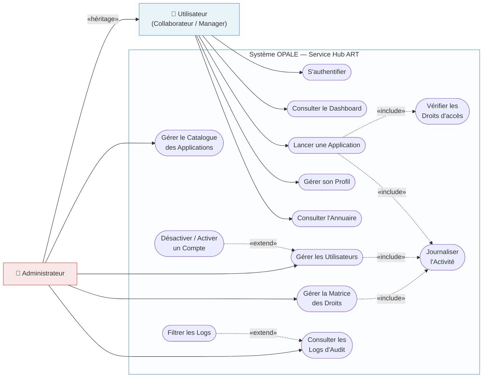
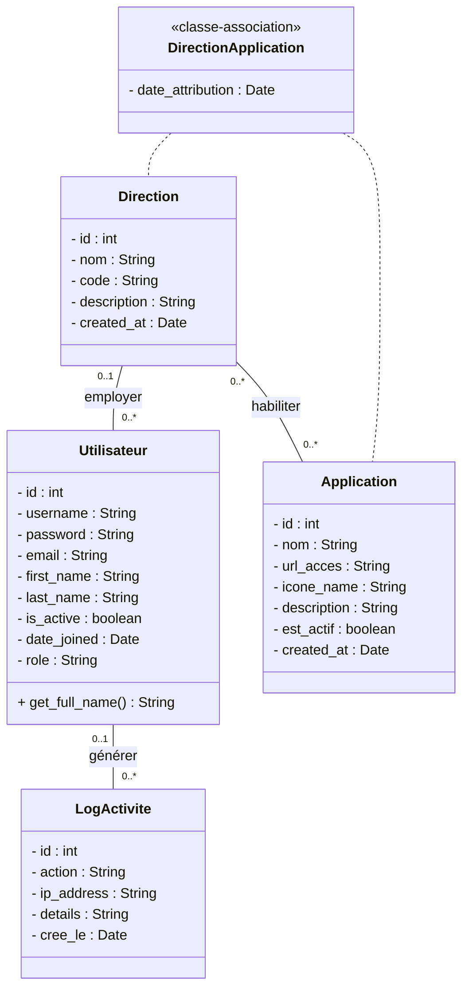
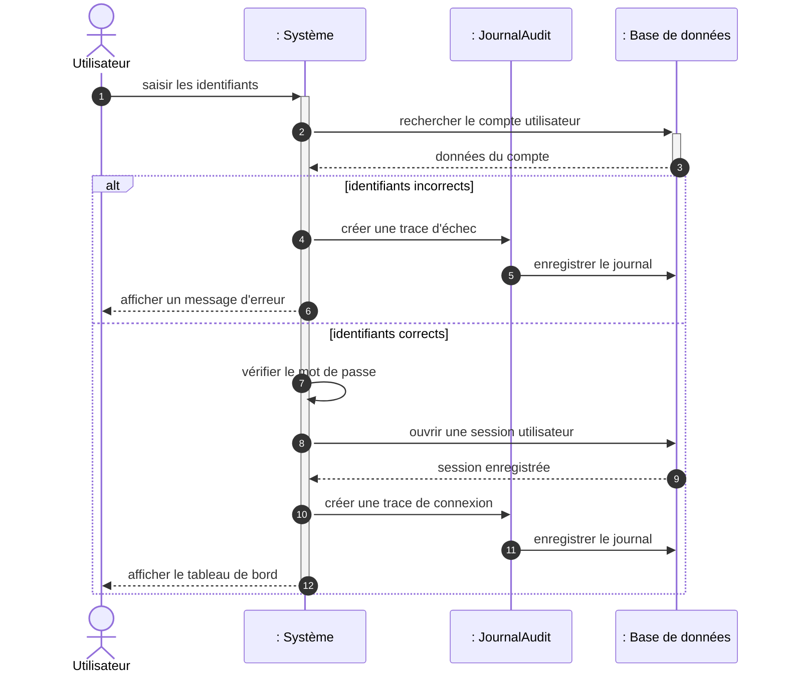
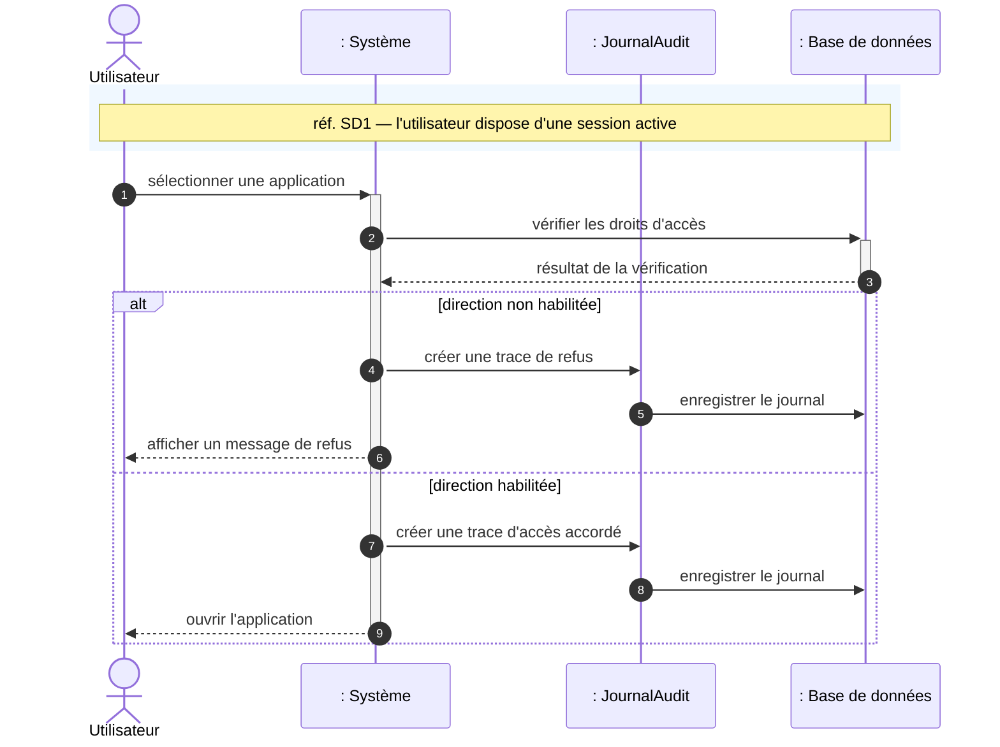
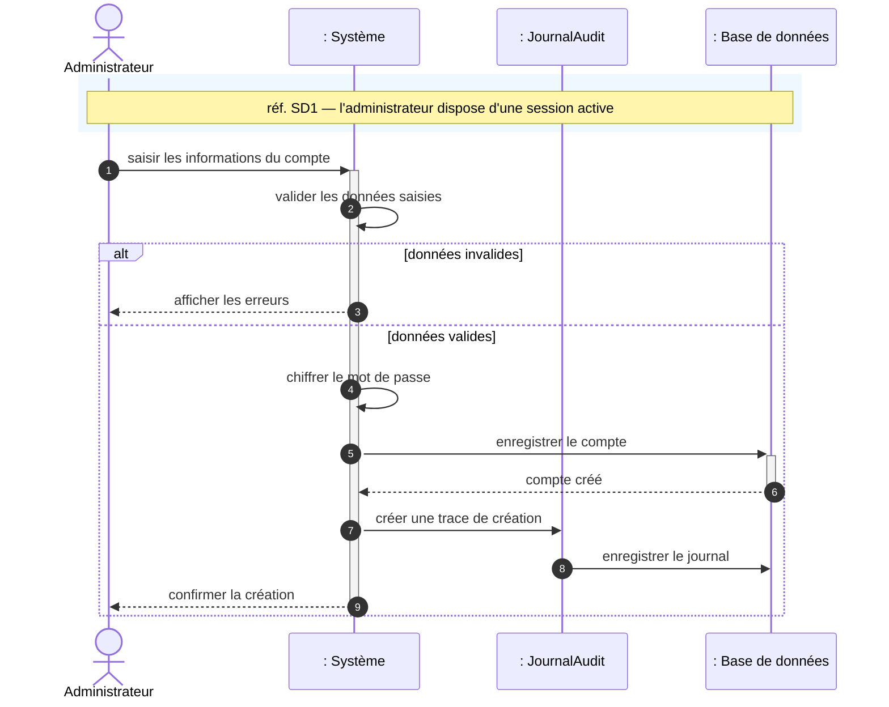
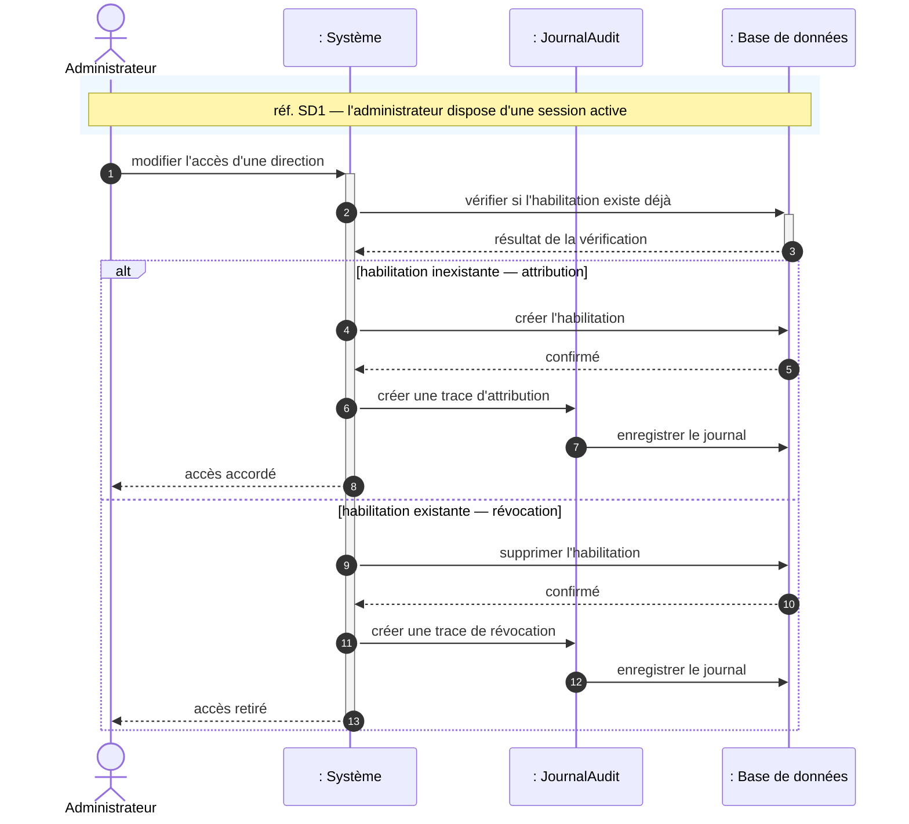
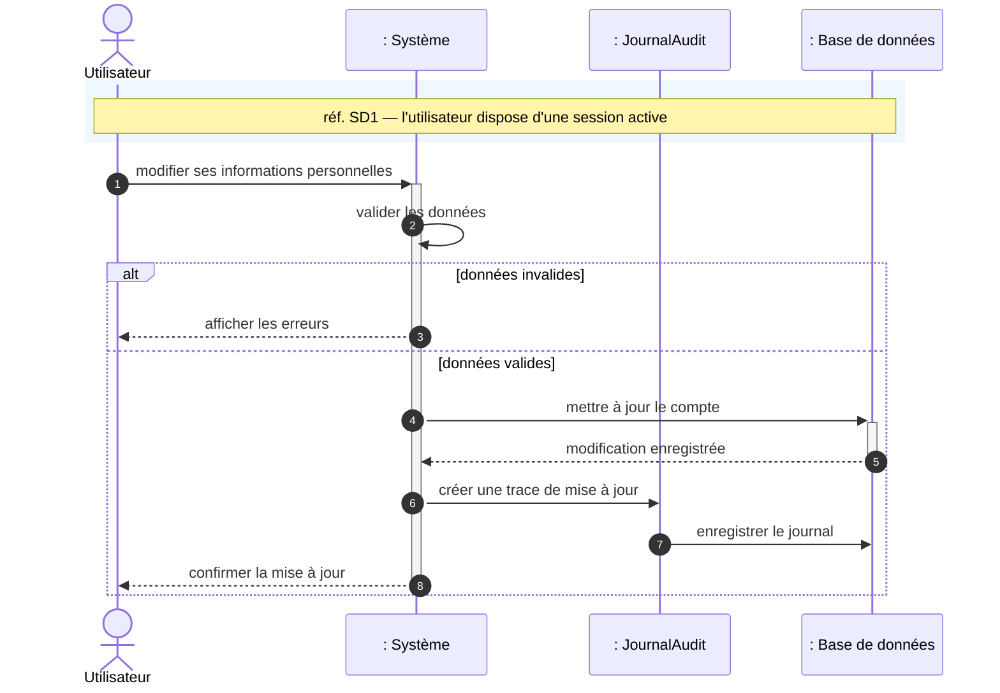
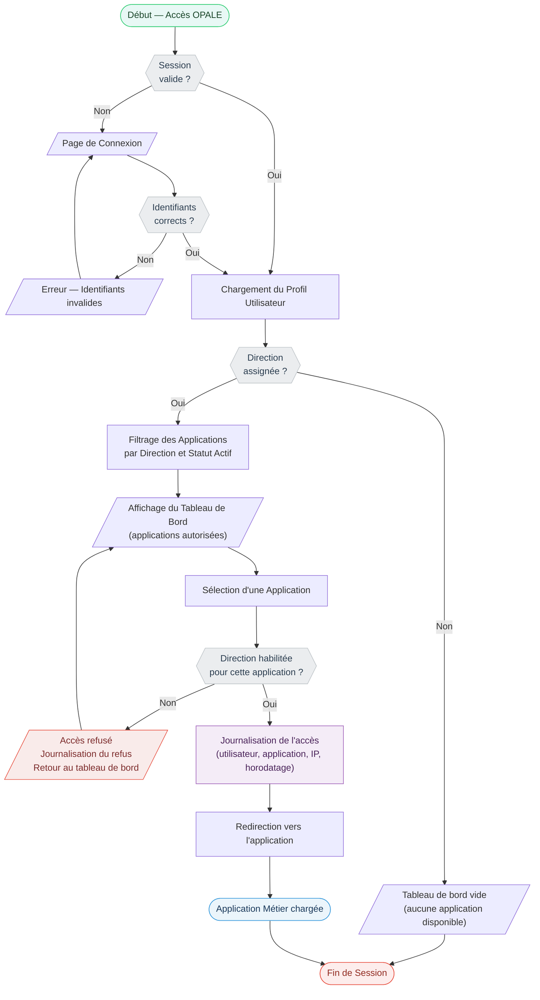
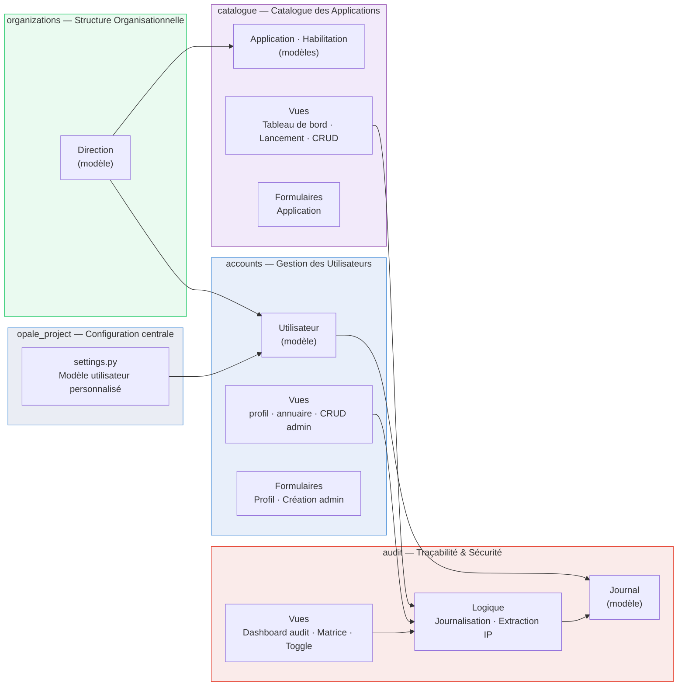

# Documentation Technique UML — Projet OPALE

---

## 1. Diagramme de Cas d'Utilisation (Use Case Diagram)

### Description

Ce diagramme identifie les deux acteurs principaux du système OPALE et leurs interactions. L'**Utilisateur** (Collaborateur ou Manager) est le principal consommateur du Hub. L'**Administrateur** hérite de tous les cas d'utilisation de l'Utilisateur et dispose de fonctions de gestion étendues. Le cas « Lancer une Application » inclut systématiquement la vérification des droits directionnels, cœur du mécanisme d'habilitation d'OPALE.

---

## 2. Diagramme de Classes (Class Diagram)

### Description

Ce diagramme représente le schéma de données complet du projet, en correspondance exacte avec les modèles définis dans le code métier (`models.py`). La classe **`Utilisateur`** regroupe les informations du profil. La **`Direction`** est le pivot de sécurité central. **`DirectionApplication`** est la classe d'association de la relation entre une direction et plusieurs applications (l'habilitation). **`LogActivite`** trace chaque action réalisée. Les associations sont bidirectionnelles (sans flèche) et annotées de verbes à l'infinitif.

---

## 3. Diagrammes de Séquence

---

### SD 1 : Authentification Sécurisée

**Description :** Ce diagramme modélise le processus de connexion d'un utilisateur au portail OPALE. L'utilisateur soumet ses identifiants. Le système vérifie les informations en base de données. Si la vérification réussit, une session est créée, la connexion est journalisée, et l'utilisateur est redirigé vers son tableau de bord personnalisé. En cas d'échec, la tentative est également tracée et un message d'erreur est affiché.

---

### SD 2 : Lancement d'une Application Métier

**Description :** Ce flux est le cœur du Hub OPALE. Lorsqu'un utilisateur clique sur une application, le système vérifie en temps réel que sa direction est bien habilitée pour cet accès. Si l'habilitation est confirmée, l'événement est tracé dans le journal d'audit et l'utilisateur est redirigé vers l'application. Tout accès non autorisé est également journalisé et l'utilisateur en est refusé l'accès.

---

### SD 3 : Gestion CRUD des Utilisateurs (par l'Administrateur)

**Description :** Ce diagramme décrit le cycle complet de création d'un compte utilisateur. L'administrateur remplit les informations. Le système valide les données saisies, sécurise le mot de passe avant stockage, puis enregistre le nouveau compte en base de données. L'action est tracée dans le journal d'audit.

---

### SD 4 : Attribution des Droits — Matrice Directions/Applications

**Description :** L'administrateur modifie les droits d'accès sous forme de grille. L'habilitation est créée ou supprimée selon si elle existait.

---

### SD 5 : Mise à jour du Profil Collaborateur

**Description :** Ce diagramme décrit la mise à jour des informations personnelles d'un collaborateur.

---

## 4. Diagramme d'Activité (Activity Diagram)

### Description

Ce diagramme modélise le processus global d'un employé depuis l'accès au portail jusqu'au lancement d'une application. Trois points de contrôle critiques structurent ce flux :

1. **Vérification de Session :** Présence d'une session valide ou redirection vers la page de login.
2. **Filtrage par Direction :** Le tableau de bord n'affiche que les applications pour lesquelles la direction de l'utilisateur est habilitée.
3. **Contrôle au Lancement :** Vérification redondante et systématique à chaque tentative de lancement, garantissant qu'un accès direct à l'URL est également bloqué.

---

## 5. Architecture des Modules — Vue des Dépendances

---
